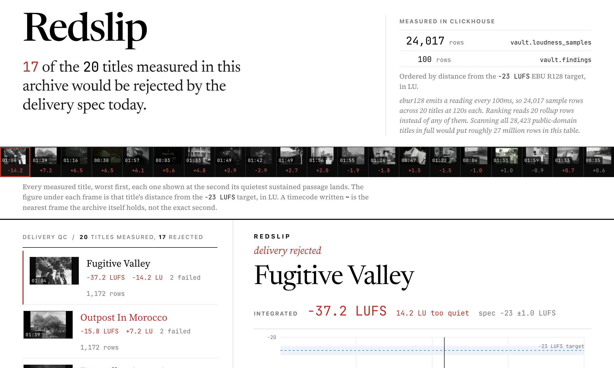
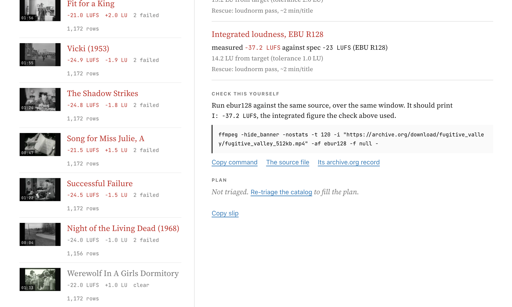
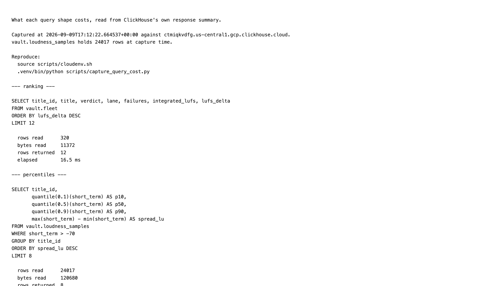
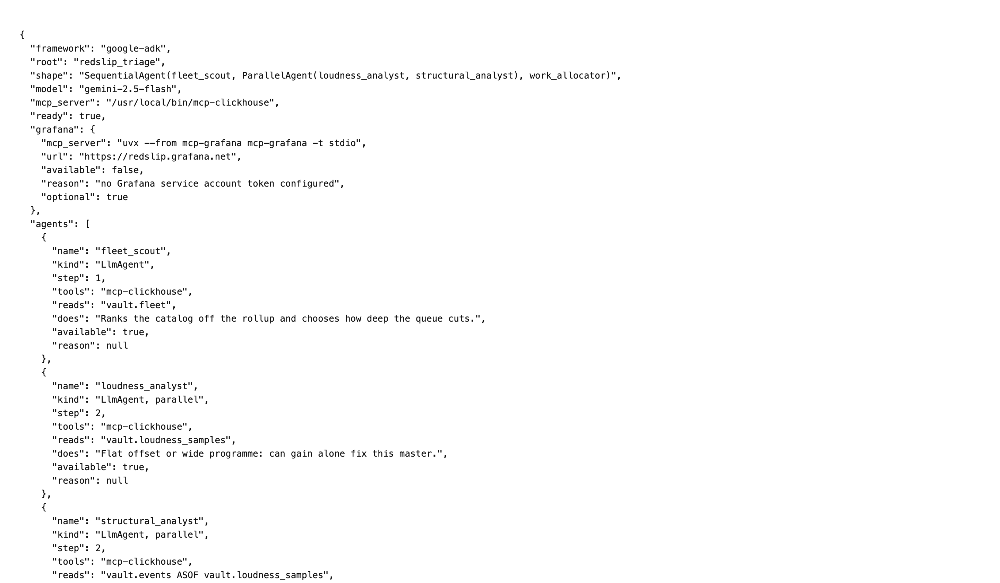
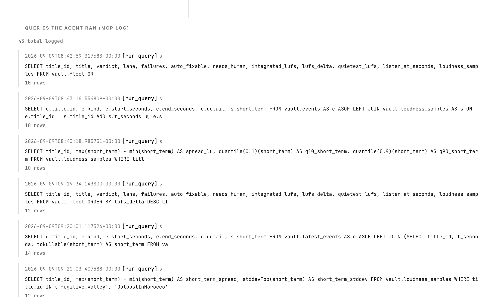
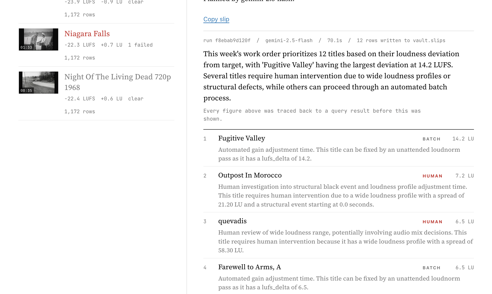

# Redslip

Devpost submission copy. Field names below match the form.

**Project name:** Redslip

---

## Elevator pitch

> Redslip ranks a whole film archive by which masters would be rejected on delivery today: 17 of 20 titles fail, ordered by LU from target over 24,017 ClickHouse loudness rows.

*174 characters, counted, against the 200 limit.*

---

## About the project

One rejected master is an incident. A hundred of them is a pattern, and the pattern is
the thing nobody in delivery ever sees, because each rejection arrives as its own email,
to its own person, weeks apart from the last one. There is no page anywhere that shows
the whole set at once.

Redslip is that page. The document below is built the way the product is: the catalog
first, then one row out of it, then the raw measurement underneath that row. Every claim
carries the statement that produced it and what the statement cost to run.



### Level one: the catalog

Twenty public-domain features from archive.org, each measured live with ffmpeg, ranked by
absolute distance from the EBU R128 target of -23.0 LUFS.

| Title | Integrated | LU from target | Verdict | Lane |
|---|---|---|---|---|
| Fugitive Valley | -37.2 LUFS | 14.2 | FAIL | BATCH |
| Outpost In Morocco | -15.8 LUFS | 7.2 | FAIL | BATCH |
| quevadis | -16.5 LUFS | 6.5 | FAIL | BATCH |
| Farewell to Arms, A | -16.5 LUFS | 6.5 | FAIL | BATCH |
| Romance on the Run | -16.9 LUFS | 6.1 | FAIL | BATCH |
| Night Tide, corrected audio | -17.4 LUFS | 5.6 | FAIL | BATCH |
| Follow Your Heart | -18.2 LUFS | 4.8 | FAIL | BATCH |
| framed | -20.1 LUFS | 2.9 | FAIL | HUMAN |
| Crimson Romance | -25.9 LUFS | 2.9 | FAIL | BATCH |
| Rough Riding Ranger | -20.3 LUFS | 2.7 | FAIL | BATCH |
| Fit for a King | -21.0 LUFS | 2.0 | FAIL | BATCH |
| Vicki (1953) | -24.9 LUFS | 1.9 | FAIL | HUMAN |
| The Shadow Strikes | -24.8 LUFS | 1.8 | FAIL | HUMAN |
| Successful Failure | -24.5 LUFS | 1.5 | FAIL | HUMAN |
| Song for Miss Julie, A | -21.5 LUFS | 1.5 | FAIL | BATCH |
| Werewolf In A Girls' Dormitory | -22.0 LUFS | 1.0 | PASS | READY |
| Night of the Living Dead (1968) | -24.0 LUFS | 1.0 | FAIL | HUMAN |
| What Becomes Of The Children? | -23.9 LUFS | 0.9 | PASS | READY |
| Niagara Falls | -22.3 LUFS | 0.7 | FAIL | HUMAN |
| Night Of The Living Dead, 720p | -22.4 LUFS | 0.6 | PASS | READY |

Seventeen fail, three pass. The three passes matter more than they look: a gate that
fails everything is not measuring anything.

The statement that produces that table, and what the server charged for it:

```sql
SELECT title_id, title, verdict, lane, failures, integrated_lufs, lufs_delta
FROM vault.fleet
ORDER BY lufs_delta DESC
LIMIT 12
```

| Measure | Value |
|---|---|
| Rows read | 320 |
| Bytes read | 11,372 |
| Rows returned | 12 |
| Elapsed | 16.5 ms |

Ordering is absolute distance in LU, not raw LUFS. Sorting on raw LUFS puts every
too-loud title at one end of the list and every too-quiet one at the other, which sorts
by the direction of the error rather than its size. Fugitive Valley at 14.2 LU stays
first whether the next title is loud or quiet.

### Level two: one row

Take Night Tide. Five spec checks run against every title, and this one fails two.

| Check | Spec | Measured | Verdict |
|---|---|---|---|
| Integrated loudness, EBU R128 | -23.0 LUFS, tolerance 1.0 LU | -17.4 LUFS | 5.6 LU out |
| Integrated loudness, ATSC A/85 | -24.0 LKFS, tolerance 2.0 LU | -17.4 LKFS | 6.6 LU out |
| True peak | ceiling -1.0 dBTP | under ceiling | pass |
| Black segments | none at or over 2 s | two segments | needs a person |
| Frozen video | no freeze events | none | pass |

The slip prints the command that produced the loudness figure, generated from the source
URL stored in `vault.sources` rather than assembled by hand, so anyone with ffmpeg can
check it without cloning anything:

```bash
ffmpeg -hide_banner -nostats -t 120 \
  -i "https://archive.org/download/fugitive_valley/fugitive_valley_512kb.mp4" \
  -af ebur128 -f null -
```

Run against the worst title in the ledger, that prints:

```
  Integrated loudness:
    I:         -37.2 LUFS
    Threshold: -47.3 LUFS
```

which is the figure the slip for Fugitive Valley carries, arrived at by a route that
shares no code with the pipeline.



### Level three: underneath the row

Night Tide's two black segments look identical in `vault.events`. They are not the same
thing at all, and the difference is not in the event row. It is in what the audio was
doing at the instant the picture went black.

```sql
SELECT e.title_id, e.kind, e.start_seconds, e.end_seconds, s.short_term
FROM vault.latest_events AS e
ASOF LEFT JOIN (
  SELECT title_id, t_seconds, toNullable(short_term) AS short_term
  FROM vault.loudness_samples
) AS s
  ON e.title_id = s.title_id AND s.t_seconds <= e.start_seconds
WHERE e.title_id = 'NightTide16x9CorrectedAudio'
ORDER BY e.start_seconds
```

| Kind | Start | End | Short-term loudness at onset | Reading |
|---|---|---|---|---|
| silence | 0.02 s | 2.76 s | null | no sample before it, so unmeasured |
| black | 1.17 s | 2.80 s | -120.7 dB | silence under the black: a reel change |
| black | 5.33 s | 6.97 s | -42.0 dB | programme audio under the black: wants a person |

Same table, same two rows, opposite dispositions. Only the point-in-time join separates
them, and the `toNullable` is load-bearing: an `ASOF LEFT JOIN` that matches nothing
fills a `Float32` with its type default of `0.0`, which reads as digital full scale. A
miss has to arrive as null and be reported as unmeasured, which is what the first row
above shows.

The stream that join reads is the expensive one, and the ledger says so:

```sql
SELECT title_id,
       quantile(0.1)(short_term) AS p10,
       quantile(0.5)(short_term) AS p50,
       quantile(0.9)(short_term) AS p90,
       max(short_term) - min(short_term) AS spread_lu
FROM vault.loudness_samples
WHERE short_term > -70
GROUP BY title_id
ORDER BY spread_lu DESC
LIMIT 8
```

| Measure | Ranking query | Percentile query |
|---|---|---|
| Rows read | 320 | 24,017 |
| Bytes read | 11,372 | 120,680 |
| Rows returned | 12 | 8 |
| Elapsed | 16.5 ms | 5.5 ms |

That gap is the whole storage argument. `ebur128` emits a reading every 100 milliseconds,
so a 90-minute feature is roughly 54,000 rows, and this 20-title scan over a
120-second window is 24,017. Ranking the catalog costs 320 rows regardless, because it
reads a rollup whose size is a function of how many titles exist rather than how much
audio was measured. The percentiles are computed by ClickHouse across the full stream,
which is why they are percentiles rather than a number somebody typed into a cell.

Both figures are read from ClickHouse's own response summary, not counted in Python, and
the capture is committed:

```bash
source scripts/cloudenv.sh
.venv/bin/python scripts/capture_query_cost.py   # writes docs/evidence/query-cost.txt
```



---

## Inspiration

The concrete case is a file anyone can open. `NightTide_512kb.mp4` on archive.org
measures at `I: -17.4 LUFS` over its first 120 seconds. The EBU R128 delivery target is
-23.0 LUFS with a tolerance of 1.0 LU, so that master is 5.6 LU out and would come back
rejected. Nothing about that is subtle, nothing about it needs a human ear, and nobody
had run the check.

Multiply it by a catalog. An archive with a few hundred titles has one question every
Monday, and it is not "is this file good". It is: which of these would a streamer reject
today, which one do I touch first, and which ones can a machine fix without booking
mix-stage time. That is a question about a corpus of measurements. Telestream Vantage,
Venera Pulsar and Interra Baton all answer per file, and a stack of per-file reports does
not rank a catalog.

Measuring was never the hard part. `ebur128` has been able to tell you a master sits 14
LU off target for years, for free. The hard part is holding a catalog of those
measurements in a shape where the ordering question stays cheap while the forensic
question stays possible, because those two want opposite storage. Ordering wants one
small row per title. Forensics wants every 100 ms reading ffmpeg ever emitted. That
tension is what a column store is for.

---

## What it does

Point Redslip at an archive and it returns a red slip per title: the failed check, the
measured number against the spec it failed, the timecode to listen to, and the bay the
title goes to.

- **BATCH** every failure on the title is auto-fixable and the loudness profile is flat,
  so an unattended `loudnorm` pass can correct it.
- **HUMAN** the title needs a person: a structural defect, or a wide loudness profile
  where a single gain change would bury the dialogue while fixing the average.
- **READY** no failed checks. It ships.

The split across the measured catalog is 11 BATCH, 6 HUMAN, 3 READY.

Five checks run against every title, giving 100 finding rows:

| Check | Titles failing |
|---|---|
| Integrated loudness, EBU R128 | 15 |
| Integrated loudness, ATSC A/85 (CALM Act) | 11 |
| Black segments at or over 2 s | 5 |
| Frozen video | 2 |
| True peak ceiling, -1.0 dBTP | 0 |

The decisions land back in the database. `vault.slips` is an append-only log of every
work order the crew has issued, one row per queued title with its lane, its rationale and
a flag recording whether each figure was traced to a returned cell. Eleven runs have
written 124 rows into it, so the queue outlives the browser tab and the next scan can be
read against the last decision.

### What the ledger will not infer

Four questions have an obvious machine answer that would be wrong, so Redslip does not
answer them.

**A 120-second window is a 120-second window.** Every title is measured over its first
two minutes, and every figure carries that window in the interface and in the API
payload. A title can normalise cleanly across an opening reel and drift later. The number
on the slip is what the scan saw, and it is never presented as a full-length measurement.

**A black frame is never auto-repaired.** A reel change, a fade and physical damage look
identical to a machine at the event-row level. Redslip stamps each one with the loudness
at its onset and routes the ambiguous ones to a person, because that judgement is a
person's.

**A missing loudness sample is reported as unmeasured, not as zero.** The `toNullable` in
the ASOF join exists so that "no reading at that instant" cannot be rendered as a level.

**The projection is labelled a projection.** archive.org holds 28,423 public-domain
titles. Scanning them all at full length would put roughly 27 million rows in
`vault.loudness_samples`. That sentence is arithmetic from the 100 ms emission rate, it
says so wherever it appears, and 20 titles are what has been measured.

**Subtitle checks are code, not findings.** Netflix TTSS reading speed, minimum cue
duration and line length are implemented and covered by tests. None of the 20 titles in
this catalog ships an SRT, so those checks contribute zero rows to every number above,
and the catalog totals are not padded with them.

---

## How we built it

**Ingestion is deterministic and holds no model.** `ingest.py` runs `ffprobe` for stream
metadata, then `ffmpeg` with `ebur128` for loudness, then `blackdetect`, `freezedetect`
and `silencedetect` for structural defects, then parses any SRT against Netflix TTSS
limits. Spec verdicts land in `vault.findings`, defect occurrences in `vault.events`, the
raw series in `vault.loudness_samples`, and the measured URL in `vault.sources`. No model
touches any of it, because a measurement a model can influence is not a measurement.

**The schema is laid out for the shape of the data.** `Gorilla` then `ZSTD(3)` on the
loudness floats, because Gorilla is the XOR-of-successive-values codec built for a slowly
varying float series. `DoubleDelta` on the scan clock. `LowCardinality(String)` on
`title_id`. `PARTITION BY cityHash64(title_id) % 8`, so re-scanning one title after a
repair is a partition drop rather than a mutation, which is what a re-delivery actually
is.

**Ranking never reads the sample stream.** `vault.title_loudness` is an
`AggregatingMergeTree` keyed on `title_id`, kept current by a materialized view whose
`GROUP BY` is the rollup's `ORDER BY`, which is the condition for the merge to stay
incremental. Ingesting title 21 merges one part in; it does not rebuild the fleet.
`vault.fleet` reads that rollup, one row per title, joined to the 100-row findings table.

That is checkable rather than argued. `EXPLAIN indexes = 1` on the ranking query is
asserted to name `vault.findings` and `vault.title_loudness` and never
`vault.loudness_samples`, in `tests/test_ranking_never_scans_samples.py`. A companion
test in the same file runs a query that genuinely scans the samples and asserts that
`EXPLAIN` does name the table then, which is what stops the first assertion from being a
check that cannot fail. The captured plan, taken through the MCP server against ClickHouse
Cloud with its control query beside it, is committed at
`docs/evidence/explain-ranking-plan.txt`.

**The crew is Google ADK, and the graph is the argument.**

```
SequentialAgent  redslip_triage
├── LlmAgent      fleet_scout          McpToolset -> mcp-clickhouse
│                 reads vault.fleet, ranks the catalog, chooses how deep to cut
│                 output_key: fleet
├── ParallelAgent evidence
│   ├── LlmAgent  loudness_analyst     McpToolset -> mcp-clickhouse
│   │             reads vault.loudness_samples for the queued titles only
│   │             output_key: loudness_evidence
│   └── LlmAgent  structural_analyst   McpToolset -> mcp-clickhouse
│                 reads vault.latest_events ASOF vault.loudness_samples
│                 output_key: structural_evidence
└── LlmAgent      work_allocator       no database tools at all
                  output_schema pinned to a pydantic WorkOrder
                  output_key: work_order
```

Every agent changes an outcome the others cannot reach. The scout decides the length of
the queue, which is a judgement about how much mix-stage time exists this week. The
loudness analyst decides whether a failure is repairable by gain, which is the difference
between BATCH and HUMAN and is in no column. The structural analyst decides whether a
black frame is damage, which needs a join no verdict row contains. The allocator holds
the ordering and the lane assignment, and holds no tools, so it can only quote its
colleagues.

The two analysts are parallel because they read different tables and neither needs the
other's answer. They are the only pair in the graph where that is true.

`GET /api/agents` on the live service reports that exact shape, the model, and the
resolved path of the MCP server binary it starts.



**ClickHouse is reached only through the official MCP server.** Three of the four agents
hold `mcp-clickhouse` through ADK's `McpToolset` over `StdioConnectionParams`, with
`tool_filter=["run_query", "list_tables", "list_databases"]`. They compose their own SQL;
nothing in the agent layer runs a stored query string. Bulk insertion of the 100 ms
samples stays on `clickhouse-connect`, because `run_query` is not an insert path and
pretending otherwise would be worse engineering dressed as better compliance.



**The agents cannot write, and that is enforced twice, in two different places.**

The client-side gate is `before_tool_callback=_guard_tool` in `agent/crew.py`. It strips
line comments, block comments and string literals before matching, so
`SELECT 1 --\n; DROP TABLE x` cannot walk through a prefix check, and a
`WHERE title_id IN (...)` list containing the word "insert" is not read as a statement. A
refused call is short-circuited before it reaches the server, recorded as refused, and
the model is told why so it stops retrying.

Our own callback passing our own tests proves very little about the server, so the other
end was checked directly. Two probes were sent through a live MCP session, deliberately
bypassing the callback, and both were refused by the database:

```
CREATE TABLE IF NOT EXISTS vault.readonly_probe (probe UInt8) ENGINE = Null
  -> Code: 164. DB::Exception: default: Cannot execute query in readonly mode. (READONLY)

INSERT INTO vault.events SELECT * FROM vault.events WHERE 1 = 0
  -> Code: 164. DB::Exception: default: Cannot execute query in readonly mode. (READONLY)
```

`vault.events` held 29 rows before and 29 rows after, and `vault.readonly_probe` does not
exist. Both probes are harmless even if the guarantee had failed, because a Null-engine
table stores nothing and an `INSERT ... WHERE 1 = 0` selects no rows: a probe that would
damage the archive if the guarantee failed is not a way to test the guarantee. The
transcript is committed at `docs/evidence/readonly-refusal.txt` and reproduced with
`.venv/bin/python scripts/capture_mcp_evidence.py`.

**Verification is a Python equality check, not a second model.** `verify_against_cells`
compares every figure on the work order against the numeric cells MCP actually returned
during the run, keeping each cell in its exact form and rounded to one decimal, so that
quoting -26.14 as -26.1 counts as quoting the database while quoting -19.0 does not. Each
run reports `verified` and lists any unsupported figure. There is deliberately no critic
agent: checking whether the allocator invented a number is an equality test, so it is
written as one.

**Gemini is required. Grafana is not.** With no model credentials `run_crew` raises
`GeminiRequired` and produces nothing, and `tests/test_gemini_required.py` covers the
crew, the synchronous entry point, and a scan of the whole agent package for a
reintroduced canned plan. A fifth agent publishes the finished work order to Grafana
Cloud through the official `mcp-grafana` server, and that coupling is structural rather
than a toggle: with no token the agent is not in the graph at all and the run reports the
step as skipped, with a reason and a null publish payload; with a token it is in the
graph and is not optional. `tests/test_grafana_is_optional.py` asserts both graph shapes,
asserts the ClickHouse crew is identical either way, and asserts `/api/agents` still
reports `ready: true` on ClickHouse readiness alone. The deployed service carries no
Grafana token, so that is the path a judge actually runs.

The web layer is FastAPI streaming each composed statement as server-sent events,
deployed on Cloud Run against ClickHouse Cloud.



A run against the live service: `run f8ebab9d120f`, `gemini-2.5-flash`, 70.1 s end to
end, 12 rows written to `vault.slips`, every figure traced back to a query result before
it was drawn.

---

## Challenges we ran into

**The suite reported 91 passed while never touching ClickHouse.** On a clean checkout
with no credentials, `pytest tests/ -q` printed `91 passed, 32 skipped in 2.40s` and
exited 0, which reads as a pass. All 32 skips were the tests that read the measured
catalog, which is the integration this entry rests on. The tally could not distinguish "nothing is
broken" from "nothing was tried", because pytest counts a skip as a non-failure.

Pointed at the real catalog, the same command reports:

```
$ source scripts/cloudenv.sh          # do not pipe it, a subshell discards the exports
$ .venv/bin/python -m pytest tests/ -q
catalog: ClickHouse integration exercised against ctmiqkvdfg.us-central1.gcp.clickhouse.cloud
117 passed, 6 skipped, 22 warnings in 137.55s (0:02:17)
```

| Run | Result | Wall time |
|---|---|---|
| Bare clone, no credentials | 91 passed, 32 skipped, exit 0 | 2.40 s |
| Pointed at the measured catalog | 117 passed, 6 skipped, exit 0 | 137.55 s |
| `CLICKHOUSE_HOST` set to an unreachable host | 91 passed, 18 skipped, 14 errors, exit 1 | 3.79 s |

Twenty-six tests moved from skipped to passing, and the runtime went up by a factor of
57. That factor is the point: the fast run was fast because it was not doing the work.

The fix, in `tests/conftest.py`, splits the two cases that used to look the same. A bare
clone with no `CLICKHOUSE_HOST` still skips, because a fresh clone should not read as a
broken project. A run that names a remote host is asserting the catalog is there, so the
gate failing is now a broken configuration and errors instead of skipping, which is the
third row of that table. Either way `pytest_terminal_summary` states outright whether the
integration was exercised, in green when it was and in red when it was not.

**Two MCP SDKs that could not share a room.** ADK's `McpToolset` is built against
`mcp<2`. The official `mcp-clickhouse` package pulls `fastmcp`, which requires `mcp>=2`.
There is no pin that satisfies both, and time went into looking for one before the
premise turned out to be wrong. An MCP server is a separate process by design. It does
not need to be importable from our environment, it only needs to exist as an executable.
`uv tool install mcp-clickhouse` gives it its own environment and the conflict stops
existing rather than getting negotiated. The Dockerfile does the same at
`/usr/local/bin/mcp-clickhouse`, which is the path `/api/agents` reports.

**An ordering that looked right and was wrong.** The first ledger sorted on raw LUFS. It
produced a plausible-looking list that ranked a title 1 LU too quiet above one 7 LU too
loud. Switching to absolute distance from target changed which titles a QC lead touches
first, which is the entire output of the product.

**An ASOF join that reported silence as full scale.** `ASOF LEFT JOIN` fills an unmatched
right-hand `Float32` with `0.0`, and 0.0 in this column means digital full scale. An
event starting before the first loudness sample came back looking like the loudest
possible signal, which is the exact inverse of the truth. `toNullable(short_term)` in the
sub-select makes a miss arrive as null, and the agents are instructed to report a null as
unmeasured rather than as a level.

---

## Accomplishments that we're proud of

The access pattern is checkable rather than asserted. `EXPLAIN indexes = 1` naming the
rollup and not the sample stream is a claim anyone can run, and the companion test
proving `EXPLAIN` does name the samples table when a query reads it is what stops the
first test from being a check that cannot fail.

The read-only guarantee is enforced by ClickHouse, not by our own callback. Two probes
sent through a live MCP session came back `Code 164 READONLY`, and 29 rows survived both.

One number was confirmed by a route that shares nothing with the pipeline: an independent
`ffmpeg` run against the public source measured Fugitive Valley at `I: -37.2 LUFS`,
matching the stored finding exactly.

The test suite refuses to report green on an integration it did not exercise, and says so
in the terminal summary in red. That was built after catching the suite doing exactly
that.

---

## What we learned

An API that returns without an error has accepted your request, and that is all it has
done. The same goes for a test suite: a tally that counts a skip as a non-failure is a
green light with no information in it.

Giving an agent fewer tools made it more trustworthy. The allocator, which produces the
actual output, is the one agent in the graph with no database access, so the worst it can
do is misquote colleagues whose statements were recorded.

Deciding not to build the obvious agent was the better call twice over. A critic agent
auditing the allocator does the work of a short equality test, and a second model would
have added latency and one more thing that can hallucinate.

The version conflict was the most useful mistake, because pinning was never going to work
and the process boundary was sitting there the whole time.

---

## What's next for Redslip

Full-length scans instead of the 120-second window, which is roughly six minutes of
ffmpeg per title and a partition drop per re-scan under the current layout. A catalog
that ships SRTs, so the TTSS path earns findings rather than only tests. And the part
deliberately left out: handing a BATCH-lane title to a `loudnorm` pass and re-measuring
to prove the delta. Redslip measures, ranks and dispatches, and the slip says so.

---

## Built with

Google ADK (`google-adk`), Gemini 2.5 Flash, Google Cloud Run, ClickHouse Cloud, the
official `mcp-clickhouse` MCP server over stdio via ADK `McpToolset`, the official
`mcp-grafana` server for the optional board, `clickhouse-connect` for bulk sample
ingestion, ffmpeg (`ebur128`, `blackdetect`, `freezedetect`, `silencedetect`) and
ffprobe, Python 3.13, `uv`, FastAPI with server-sent events, pytest, Docker, archive.org
as the source catalog, and vanilla HTML and CSS with Newsreader and JetBrains Mono.

---

## Links

**Live:** https://vault-387894104564.us-central1.run.app

The ledger renders immediately from a deterministic query, so there is nothing to wait
for on load. Pressing triage runs the ADK crew and streams each agent's SQL as it is
composed, roughly 70 to 120 seconds end to end. The spread is Gemini latency rather than
query time.

**Repo:** https://github.com/passionate-dev7/vault (MIT licence, `LICENSE` in the root)

**Reproduce a number without cloning anything:**

```bash
ffmpeg -hide_banner -nostats -t 120 \
  -i "https://archive.org/download/fugitive_valley/fugitive_valley_512kb.mp4" \
  -af ebur128 -f null -
```

That prints `I: -37.2 LUFS`, 14.2 LU from the EBU R128 target of -23.0, which is the
figure at the top of the ledger.

**Run it locally:**

```bash
git clone https://github.com/passionate-dev7/vault
cd vault
uv sync
uv tool install mcp-clickhouse
uv run python migrate.py
uv run python ingest.py --limit 20
bash run_web.sh
```
